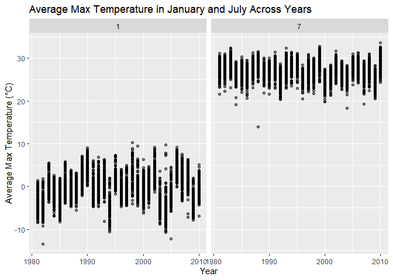
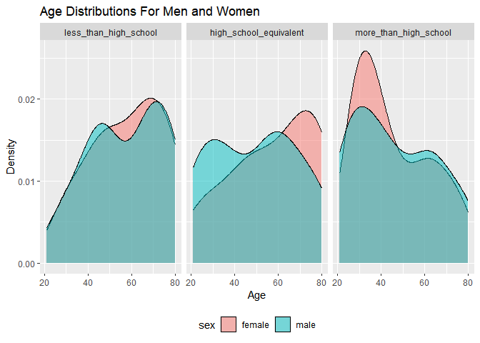
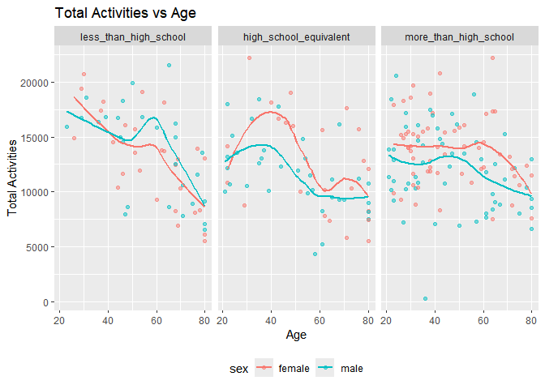
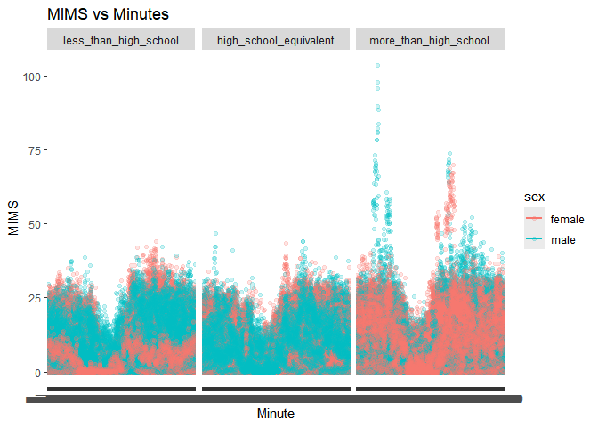
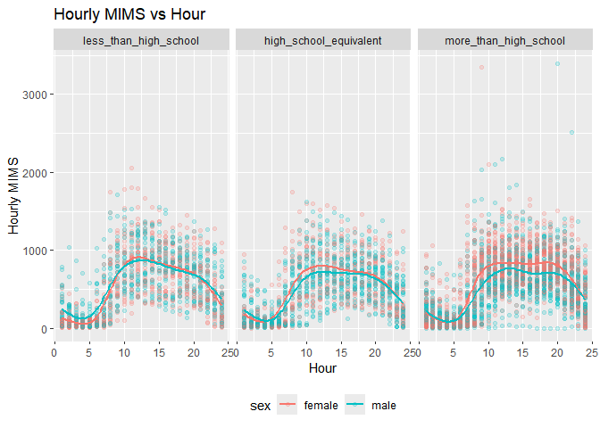
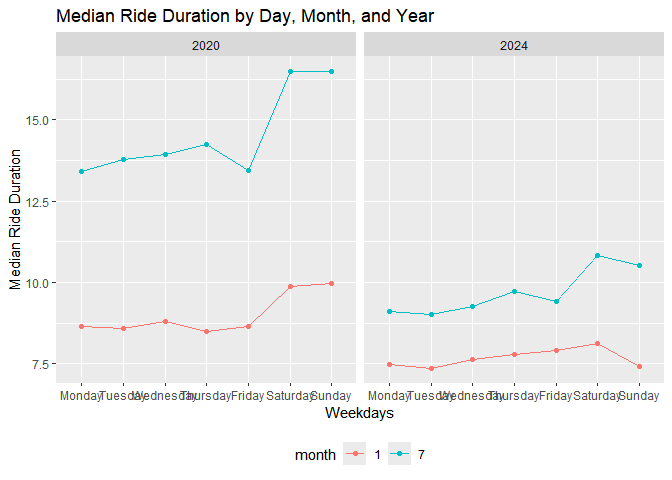
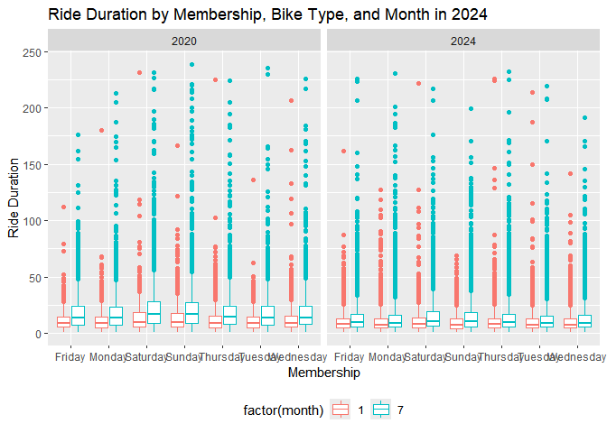
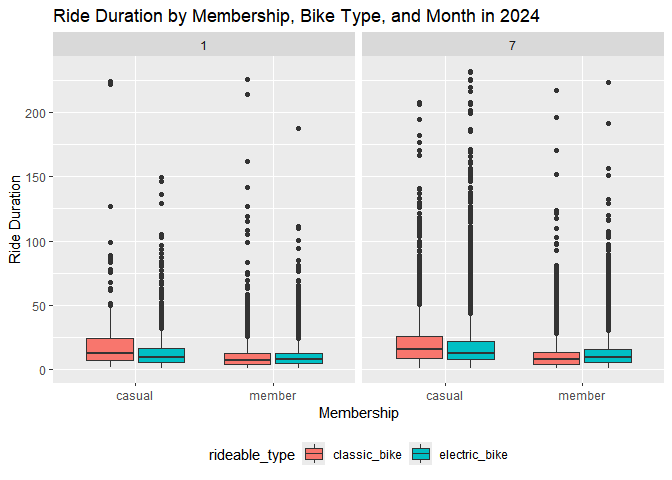

p8105_hw3_hp2661
================
Huizhong Peng
2024-10-14

``` r
library(tidyverse)
library(ggplot2)
library(patchwork)
library(dplyr)
library(knitr)
```

### Problem 1

This problem uses the NY NOAA data.

``` r
library(p8105.datasets)
data("ny_noaa")

skimr::skim(ny_noaa)
```

|                                                  |         |
|:-------------------------------------------------|:--------|
| Name                                             | ny_noaa |
| Number of rows                                   | 2595176 |
| Number of columns                                | 7       |
| \_\_\_\_\_\_\_\_\_\_\_\_\_\_\_\_\_\_\_\_\_\_\_   |         |
| Column type frequency:                           |         |
| character                                        | 3       |
| Date                                             | 1       |
| numeric                                          | 3       |
| \_\_\_\_\_\_\_\_\_\_\_\_\_\_\_\_\_\_\_\_\_\_\_\_ |         |
| Group variables                                  | None    |

Data summary

**Variable type: character**

| skim_variable | n_missing | complete_rate | min | max | empty | n_unique | whitespace |
|:--------------|----------:|--------------:|----:|----:|------:|---------:|-----------:|
| id            |         0 |          1.00 |  11 |  11 |     0 |      747 |          0 |
| tmax          |   1134358 |          0.56 |   1 |   4 |     0 |      532 |          0 |
| tmin          |   1134420 |          0.56 |   1 |   4 |     0 |      548 |          0 |

**Variable type: Date**

| skim_variable | n_missing | complete_rate | min        | max        | median     | n_unique |
|:--------------|----------:|--------------:|:-----------|:-----------|:-----------|---------:|
| date          |         0 |             1 | 1981-01-01 | 2010-12-31 | 1997-01-21 |    10957 |

**Variable type: numeric**

| skim_variable | n_missing | complete_rate |  mean |     sd |  p0 | p25 | p50 | p75 |  p100 | hist  |
|:--------------|----------:|--------------:|------:|-------:|----:|----:|----:|----:|------:|:------|
| prcp          |    145838 |          0.94 | 29.82 |  78.18 |   0 |   0 |   0 |  23 | 22860 | ▇▁▁▁▁ |
| snow          |    381221 |          0.85 |  4.99 |  27.22 | -13 |   0 |   0 |   0 | 10160 | ▇▁▁▁▁ |
| snwd          |    591786 |          0.77 | 37.31 | 113.54 |   0 |   0 |   0 |   0 |  9195 | ▇▁▁▁▁ |

Description:

This dataset has 2595176 rows and 7 columns, including 3 character
variables (id, tmin, tmax), 3 numeric variables (prcp, snow, snwd) and 1
date variable. The missing rates for variables “tmin” and “tmax” are
very high, almost reaching half. And snowfall,snow depth and
precipitation also have some missing values.

``` r
# Create separate variables for year, month, and day
# Convert temperature, precipitation, and snowfall to appropriate units

noaa_df <-  ny_noaa |> 
  janitor::clean_names() |> 
  mutate(
    year = lubridate::year(date), 
    month = lubridate::month(date), 
    day = lubridate::day(date), 
    tmin = as.integer(tmin) / 10, 
    tmax = as.integer(tmax) / 10,
    prcp = prcp / 10
  )

# snowfall common value

snow_common <- noaa_df |> 
  filter(!is.na(snow)) |> 
  group_by(snow) |> 
  summarize(n_obs = n()) |> 
  arrange(desc(n_obs))

head(snow_common, n = 3)
## # A tibble: 3 × 2
##    snow   n_obs
##   <int>   <int>
## 1     0 2008508
## 2    25   31022
## 3    13   23095
```

For snowfall, the most commonly observed value is 0.0 mm.

``` r
tmax_df = noaa_df |> 
  filter(month == 1 | month == 7) |> 
  filter(!is.na(tmax)) |> 
  group_by(id, year, month) |> 
  summarize(mean_tmax = mean(tmax))

ggplot(tmax_df, aes(x = year, y = mean_tmax)) + 
  geom_point(alpha = .5) + 
  facet_grid(~month) + 
  labs(title = "Average Max Temperature in January and July Across Years",
       x = "Year", 
       y = "Average Max Temperature (°C)")
```

<!-- -->

The average max temperature in July is higher than the average max
temperature in January from 1981 to 2010. And there are many outliers
such as the temperature which is below -10 °C in January, 1982.

``` r
p1 <- noaa_df |> 
  filter(!is.na(tmin)) |> 
  filter(!is.na(tmax)) |> 
  ggplot(aes(x = tmin, y = tmax)) + 
  geom_hex() + 
  labs(title = "Tmax vs Tmin", x = "Tmin (°C)", y = "Tmax (°C)")

p2 <- noaa_df |> 
  filter(snow > 0 & snow < 100) |> 
  ggplot(aes(x = snow, fill = as.factor(year))) + 
  geom_density(alpha = .1) + 
  labs(title = "Distribution of Snowfall Values (0 < Snow < 100 mm)", 
       x = "Snowfall (mm)",
       y = "Density") + 
  viridis::scale_fill_viridis(discrete = TRUE)

p1 + p2
```

<!-- -->

### Problem 2

``` r
accel_df = read_csv("./nhanes_accel.csv") |> janitor::clean_names()
covar_df = read_csv("./nhanes_covar.csv", skip = 4) |> 
  janitor::clean_names() |> 
  drop_na() |> 
  filter(age >= 21)

merged_nhanes = left_join(covar_df, accel_df, by = "seqn") |> 
  mutate(
    sex = case_match(sex, 1 ~ "male", 2 ~ "female"), 
    education = case_match(education, 1 ~ "less_than_high_school",
                           2 ~ "high_school_equivalent",
                           3 ~ "more_than_high_school")
  )

sex_edu <- merged_nhanes |> 
  group_by(education, sex) |> 
  summarize(n_obs = n())

kable(sex_edu)
```

| education              | sex    | n_obs |
|:-----------------------|:-------|------:|
| high_school_equivalent | female |    23 |
| high_school_equivalent | male   |    35 |
| less_than_high_school  | female |    28 |
| less_than_high_school  | male   |    27 |
| more_than_high_school  | female |    59 |
| more_than_high_school  | male   |    56 |

``` r

merged_nhanes <- merged_nhanes |> 
  mutate(education = factor(education, 
                            levels = c("less_than_high_school", 
                                       "high_school_equivalent", 
                                       "more_than_high_school")))

ggplot(merged_nhanes,aes(x = age, fill = sex)) + 
  geom_density(alpha = .5) + 
  facet_grid(. ~ education) + 
  labs(title = "Age Distributions For Men and Women", 
       x = "Age",
       y = "Density") + 
  theme(legend.position = "bottom")
```

<!-- -->

For those who have high school equivalent education level, the number of
women increases before age 70 of women and before age 60 of men, and
there are more women than men among those over 60. For those who have
less than high school education level, the number of women increases
before age 70, and there are more women than men among those who are
over 50 and less than 70 years old. For those who have more than high
school education level, the number of women decreases after age 35, and
there are more women than men among those who are over 25 and less than
45 years old.

``` r
merged_nhanes <- merged_nhanes |>  
  mutate(total_mims = rowSums(across(min1:min1440)))

ggplot(merged_nhanes, aes(x = age, y = total_mims, color = sex)) + 
  geom_point(alpha = .5) + 
  geom_smooth(se = FALSE) + 
  facet_grid(. ~ education) + 
  labs(title = "Total Activities vs Age", 
       x = "Age",
       y = "Total Activities") + 
  theme(legend.position = "bottom")
```

<!-- -->

For those who have high school equivalent education level, there is a
decreasing trend of total activities after age 40, and the total
activities of women is more than men at most age. For those who have
less than high school education level, there is a decreasing trend of
total activities except around age 60, and the total activities are the
highest at early age among three education categories. For those who
have more than high school education level, there is a decreasing trend
of total activities after age 50 of men and after age 60 of women, and
the total activities of women is always more than men.

``` r
merged_nhanes_long <- merged_nhanes |> 
  pivot_longer(
    min1:min1440,
    names_to = "min",
    values_to = "mims")

ggplot(merged_nhanes_long, aes(x = min, y = mims, color = sex)) + 
  geom_point(alpha = .2) +
  geom_smooth(se = FALSE) + 
  facet_grid(. ~ education) + 
  labs(title = "MIMS vs Minutes", 
       x = "Minute",
       y = "MIMS")
```

<!-- -->

``` r

merged_nhanes_long_2 <- merged_nhanes |> 
  pivot_longer(
    min1:min1440, 
    names_to = "minute", 
    names_prefix = "min", 
    values_to = "mims"
  ) |>  
  mutate(hour = ceiling(as.numeric(minute) / 60)) |> 
  group_by(seqn, sex, education, hour) |> 
  summarize(hourly_mims = sum(mims))

ggplot(merged_nhanes_long_2, aes(x = hour, y = hourly_mims, color = sex)) + 
  geom_point(alpha = .2) +
  geom_smooth(se = FALSE) + 
  facet_grid(. ~ education) + 
  labs(title = "Hourly MIMS vs Hour", 
       x = "Hour",
       y = "Hourly MIMS") + 
  theme(legend.position = "bottom")
```

<!-- -->

The MIMS increases from 5am to 10am and keeps steady. And it decreases
after 8pm. For those who have more than high school education level, the
MIMS among women is higher than men.

### Problem 3

``` r
jan_2020 = read_csv("./Jan 2020 Citi.csv") |> 
  janitor::clean_names() |> 
  mutate(
    year = 2020,
    month = 1
  )
jul_2020 = read_csv("./July 2020 Citi.csv") |> 
  janitor::clean_names() |> 
  mutate(
    year = 2020,
    month = 7
  )
jan_2024 = read_csv("./Jan 2024 Citi.csv") |> 
  janitor::clean_names() |> 
  mutate(
    year = 2024,
    month = 1
  )
jul_2024 = read_csv("./July 2024 Citi.csv") |> 
  janitor::clean_names() |> 
  mutate(
    year = 2024,
    month = 7
  )

bike_merged = rbind(jan_2020, jul_2020, jan_2024, jul_2024) |> drop_na()

num_rides <- bike_merged |> 
  group_by(year, month, member_casual) |> 
  summarize(n_obs = n()) |> 
  arrange(year, month)

num_rides_wide <- num_rides |> 
  pivot_wider(
    names_from = member_casual,
    values_from = n_obs
  )

kable(num_rides_wide)
```

| year | month | casual | member |
|-----:|------:|-------:|-------:|
| 2020 |     1 |    980 |  11418 |
| 2020 |     7 |   5625 |  15388 |
| 2024 |     1 |   2094 |  16705 |
| 2024 |     7 |  10843 |  36200 |

For the casual riders, the number increased in 2020 and then decreased
from july 2020 to january 2024, and then increased sharply in 2024. For
the member riders, the number increased from 2020 to 2024.

``` r
popular <- bike_merged |> 
  filter(year == 2024, month == 7) |> 
  group_by(start_station_name) |> 
  summarize(n_rides = n()) |> 
  arrange(desc(n_rides))

head(popular, n = 5)
## # A tibble: 5 × 2
##   start_station_name       n_rides
##   <chr>                      <int>
## 1 Pier 61 at Chelsea Piers     163
## 2 University Pl & E 14 St      155
## 3 W 21 St & 6 Ave              152
## 4 West St & Chambers St        150
## 5 W 31 St & 7 Ave              145
```

``` r
median_ride <- bike_merged |> 
  mutate(
    month = as.factor(month),
    weekdays = factor(weekdays, 
              levels = c("Monday", "Tuesday", "Wednesday", "Thursday", 
                         "Friday", "Saturday", "Sunday"))
  ) |> 
  group_by(year, month, weekdays) |> 
  summarise(median_dur = median(duration))

ggplot(median_ride, aes(x = weekdays, y = median_dur, color = month)) + 
  geom_line(aes(group = month)) + 
  geom_point() + 
  facet_grid(. ~ year) + 
  labs(title = "Median Ride Duration by Day, Month, and Year", 
       x = "Weekdays",
       y = "Median Ride Duration") + 
  theme(legend.position = "bottom")
```

<!-- -->

``` r

ggplot(bike_merged, aes(x = weekdays, y = duration)) + 
  geom_boxplot(aes(color = factor(month))) + 
  facet_grid(. ~ year) + 
  labs(title = "Ride Duration by Membership, Bike Type, and Month in 2024", 
       x = "Membership",
       y = "Ride Duration") + 
  theme(legend.position = "bottom")
```

<!-- -->

The median ride duration in July is always higher than in January. The
median ride duration in 2020 is higher than in 2024, especially in July.
In 2020, the median ride duration in Saturday and Sunday is the highest.
In 2024, the median ride duration in Saturday is the highest.

``` r
type <- bike_merged |> 
  filter(year == 2024)

ggplot(type, aes(x = member_casual, y = duration, fill = rideable_type)) + 
  geom_boxplot() + 
  facet_grid(. ~ month) + 
  labs(title = "Ride Duration by Membership, Bike Type, and Month in 2024", 
       x = "Membership",
       y = "Ride Duration") + 
  theme(legend.position = "bottom")
```

<!-- -->

In 2024, there is an increase in electric bikes use duration from
January to July, especially among casual riders. In casual riders, the
duration using classic bikes is higher than electric bike, and in member
riders, the duration using classic bikes is lower than electric bike.
The median duration using electric bikes among casual riders is higher
than member riders.
